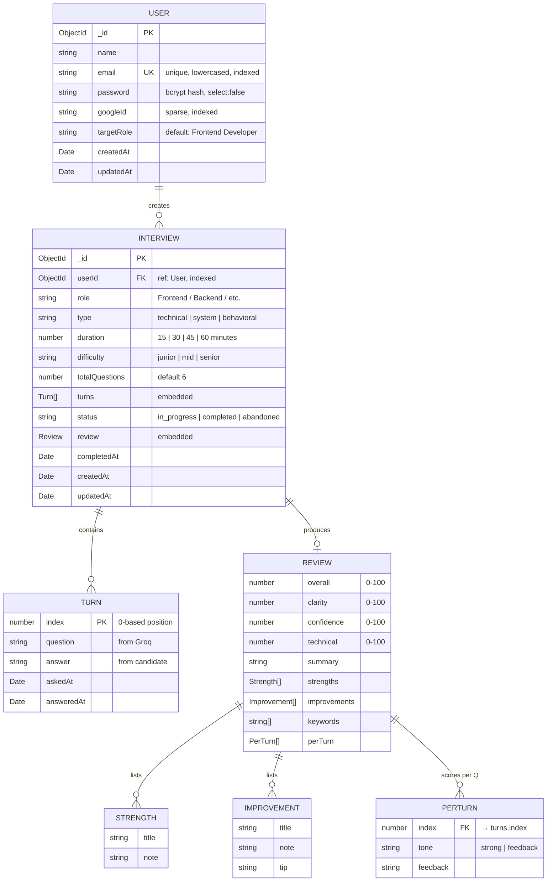

# InterviewMatrix — Database Design

MongoDB Atlas. Two collections (`users`, `interviews`). `Interview` embeds `turns[]` and `review{}` because they are always read with the parent.

---

## 1. ER Diagram (Mermaid)

> Open this file in VS Code's Markdown Preview (or view on GitHub) to see it rendered.



---

## 2. ASCII fallback

```
┌─────────────────────────────┐
│           USER              │
├─────────────────────────────┤
│ _id          ObjectId (PK)  │
│ name         String         │
│ email        String  ◆ UK   │  ─── unique, lowercased
│ password     String  ✗ hide │  ─── bcrypt(cost 10), select:false
│ googleId     String  ◇ idx  │  ─── sparse, set only for OAuth users
│ targetRole   String         │
│ createdAt    Date           │
│ updatedAt    Date           │
└──────────────┬──────────────┘
               │ 1
               │
               │ N  (userId references User._id)
               ▼
┌──────────────────────────────────────────────┐
│                 INTERVIEW                    │
├──────────────────────────────────────────────┤
│ _id              ObjectId (PK)               │
│ userId           ObjectId  ◆ FK ◇ idx        │
│ role             String                      │
│ type             enum   {technical|system|behavioral}
│ duration         Number {15|30|45|60}        │
│ difficulty       enum   {junior|mid|senior}  │
│ totalQuestions   Number  (default 6)         │
│ status           enum  ◇ idx                 │
│                  {in_progress|completed|abandoned}
│ completedAt      Date                        │
│ createdAt        Date                        │
│ updatedAt        Date                        │
│                                              │
│ turns:  [ ─── embedded array ───            ]│
│   ┌────────────────────────────────┐         │
│   │ index       Number             │         │
│   │ question    String             │         │
│   │ answer      String             │         │
│   │ askedAt     Date               │         │
│   │ answeredAt  Date               │         │
│   └────────────────────────────────┘         │
│                                              │
│ review: { ─── embedded sub-document ───     }│
│   ┌────────────────────────────────────────┐ │
│   │ overall, clarity, confidence, technical│ │
│   │ summary           String               │ │
│   │ strengths    [ {title, note} ]         │ │
│   │ improvements [ {title, note, tip} ]    │ │
│   │ keywords     [ String ]                │ │
│   │ perTurn      [ {index, tone, feedback} ]│ │
│   └────────────────────────────────────────┘ │
└──────────────────────────────────────────────┘

Legend:  ◆ unique   ◇ indexed   ✗ hidden from queries   PK primary   FK foreign
```

---

## 3. Entity dictionary

### 3.1 `User`
| Field        | Type     | Constraints                              | Notes                              |
|--------------|----------|------------------------------------------|------------------------------------|
| `_id`        | ObjectId | PK, auto                                 | Mongo default                      |
| `name`       | String   | required, trimmed                        | Display name                       |
| `email`      | String   | required, **unique**, lowercased, indexed | Login identifier                   |
| `password`   | String   | required, **`select: false`**            | bcrypt hash (cost 10)              |
| `googleId`   | String   | sparse, indexed                          | Present only for OAuth-linked users|
| `targetRole` | String   | default `"Frontend Developer"`           | Shown on dashboard / used in prompts |
| `createdAt`  | Date     | auto (`timestamps`)                      |                                    |
| `updatedAt`  | Date     | auto (`timestamps`)                      |                                    |

**Instance method:** `toPublic()` → strips `password`, returns a safe shape for API responses.

### 3.2 `Interview`
| Field             | Type     | Constraints                                                   | Notes                                |
|-------------------|----------|---------------------------------------------------------------|--------------------------------------|
| `_id`             | ObjectId | PK, auto                                                      |                                      |
| `userId`          | ObjectId | required, **FK → `User._id`**, indexed                        | Drives ownership / IDOR defense      |
| `role`            | String   | required                                                      | "Frontend Engineer", etc.            |
| `type`            | String   | required, one of `technical \| system \| behavioral`          | Steers Groq's system prompt          |
| `duration`        | Number   | required, one of `15 \| 30 \| 45 \| 60`                       | Minutes                              |
| `difficulty`      | String   | required, one of `junior \| mid \| senior`                    |                                      |
| `totalQuestions`  | Number   | default 6                                                     | Derived from `duration` at creation  |
| `turns`           | Turn[]   | embedded, `_id: false`                                        | Conversation history                 |
| `status`          | String   | enum `in_progress \| completed \| abandoned`, indexed         | Drives dashboard filters             |
| `review`          | Review   | embedded                                                      | Populated by `/complete`             |
| `completedAt`     | Date     |                                                               | Set by `/complete`                   |
| `createdAt`       | Date     | auto                                                          |                                      |
| `updatedAt`       | Date     | auto                                                          |                                      |

### 3.3 `Turn` (embedded in `Interview.turns[]`)
| Field        | Type   | Notes                                  |
|--------------|--------|----------------------------------------|
| `index`      | Number | 0-based, monotonically increasing      |
| `question`   | String | Generated by Groq                      |
| `answer`     | String | Default `""`; filled on `/answer` call |
| `askedAt`    | Date   | Default `Date.now`                     |
| `answeredAt` | Date   | Set when answer is submitted           |

### 3.4 `Review` (embedded in `Interview.review`)
| Field          | Type                                          | Notes                                  |
|----------------|-----------------------------------------------|----------------------------------------|
| `overall`      | Number                                        | 0–100, computed by Groq                |
| `clarity`      | Number                                        | 0–100                                  |
| `confidence`   | Number                                        | 0–100                                  |
| `technical`    | Number                                        | 0–100                                  |
| `summary`      | String                                        | 1–2 paragraph narrative                |
| `strengths`    | `[{ title, note }]`                           | Bulleted positives                     |
| `improvements` | `[{ title, note, tip }]`                      | Bulleted gaps + actionable tip         |
| `keywords`     | `[String]`                                    | Topics surfaced during the session     |
| `perTurn`      | `[{ index, tone: strong\|feedback, feedback }]` | Per-question critique; `index` ties back to `Turn.index` |

---

## 4. Relationships at a glance

| From       | Card. | To         | Mechanism             | Why                                       |
|------------|-------|------------|-----------------------|-------------------------------------------|
| `User`     | 1 — N | `Interview`| `Interview.userId` ref| One account, many sessions                |
| `Interview`| 1 — N | `Turn`     | **Embedded array**    | Always read together, never queried alone |
| `Interview`| 1 — 1 | `Review`   | **Embedded subdoc**   | Same — one read returns the full history  |

**Why embed instead of using separate `turns` / `reviews` collections?**
A finished interview is a *tree*: turns + review nested inside one parent. Embedding means the whole thing comes back in **one query**, with no `$lookup` join. The cost is the 16 MB BSON document limit — and at ~10 questions max per interview, you're nowhere near it.

---

## 5. Indexes

| Collection   | Index                | Purpose                                  |
|--------------|----------------------|------------------------------------------|
| `users`      | `email` (unique)     | Login lookup; enforces no duplicates     |
| `users`      | `googleId` (sparse)  | OAuth lookup; sparse = only docs that have it |
| `interviews` | `userId`             | Dashboard / list queries scoped to user  |
| `interviews` | `status`             | Filter completed vs in-progress quickly  |

---

## 6. Want a draw.io version?

Drop this XML into [app.diagrams.net](https://app.diagrams.net) (File → Import From → Device). It contains the same two-entity model with relationship arrow:

```xml
<mxfile>
  <diagram name="InterviewMatrix">
    <mxGraphModel dx="800" dy="600" grid="1" gridSize="10" guides="1" tooltips="1" arrows="1">
      <root>
        <mxCell id="0"/>
        <mxCell id="1" parent="0"/>
        <mxCell id="user" value="USER" style="shape=table;startSize=30;fillColor=#dae8fc;strokeColor=#6c8ebf;fontStyle=1" vertex="1" parent="1">
          <mxGeometry x="40" y="40" width="260" height="220" as="geometry"/>
        </mxCell>
        <mxCell id="u1" value="_id : ObjectId (PK)" style="text;align=left;spacingLeft=8" vertex="1" parent="user"><mxGeometry y="30" width="260" height="24" as="geometry"/></mxCell>
        <mxCell id="u2" value="name : String" style="text;align=left;spacingLeft=8" vertex="1" parent="user"><mxGeometry y="54" width="260" height="24" as="geometry"/></mxCell>
        <mxCell id="u3" value="email : String (UK)" style="text;align=left;spacingLeft=8" vertex="1" parent="user"><mxGeometry y="78" width="260" height="24" as="geometry"/></mxCell>
        <mxCell id="u4" value="password : String (hidden)" style="text;align=left;spacingLeft=8" vertex="1" parent="user"><mxGeometry y="102" width="260" height="24" as="geometry"/></mxCell>
        <mxCell id="u5" value="googleId : String (sparse)" style="text;align=left;spacingLeft=8" vertex="1" parent="user"><mxGeometry y="126" width="260" height="24" as="geometry"/></mxCell>
        <mxCell id="u6" value="targetRole : String" style="text;align=left;spacingLeft=8" vertex="1" parent="user"><mxGeometry y="150" width="260" height="24" as="geometry"/></mxCell>
        <mxCell id="u7" value="createdAt / updatedAt : Date" style="text;align=left;spacingLeft=8" vertex="1" parent="user"><mxGeometry y="174" width="260" height="24" as="geometry"/></mxCell>

        <mxCell id="iv" value="INTERVIEW" style="shape=table;startSize=30;fillColor=#d5e8d4;strokeColor=#82b366;fontStyle=1" vertex="1" parent="1">
          <mxGeometry x="420" y="40" width="320" height="340" as="geometry"/>
        </mxCell>
        <mxCell id="i1" value="_id : ObjectId (PK)" style="text;align=left;spacingLeft=8" vertex="1" parent="iv"><mxGeometry y="30" width="320" height="24" as="geometry"/></mxCell>
        <mxCell id="i2" value="userId : ObjectId (FK → User)" style="text;align=left;spacingLeft=8" vertex="1" parent="iv"><mxGeometry y="54" width="320" height="24" as="geometry"/></mxCell>
        <mxCell id="i3" value="role / type / difficulty : String" style="text;align=left;spacingLeft=8" vertex="1" parent="iv"><mxGeometry y="78" width="320" height="24" as="geometry"/></mxCell>
        <mxCell id="i4" value="duration : Number  (15|30|45|60)" style="text;align=left;spacingLeft=8" vertex="1" parent="iv"><mxGeometry y="102" width="320" height="24" as="geometry"/></mxCell>
        <mxCell id="i5" value="totalQuestions : Number" style="text;align=left;spacingLeft=8" vertex="1" parent="iv"><mxGeometry y="126" width="320" height="24" as="geometry"/></mxCell>
        <mxCell id="i6" value="status : in_progress | completed | abandoned" style="text;align=left;spacingLeft=8" vertex="1" parent="iv"><mxGeometry y="150" width="320" height="24" as="geometry"/></mxCell>
        <mxCell id="i7" value="turns[ ] : embedded Turn docs" style="text;align=left;spacingLeft=8;fontStyle=2" vertex="1" parent="iv"><mxGeometry y="174" width="320" height="24" as="geometry"/></mxCell>
        <mxCell id="i8" value="review { } : embedded Review subdoc" style="text;align=left;spacingLeft=8;fontStyle=2" vertex="1" parent="iv"><mxGeometry y="198" width="320" height="24" as="geometry"/></mxCell>
        <mxCell id="i9" value="completedAt : Date" style="text;align=left;spacingLeft=8" vertex="1" parent="iv"><mxGeometry y="222" width="320" height="24" as="geometry"/></mxCell>
        <mxCell id="i10" value="createdAt / updatedAt : Date" style="text;align=left;spacingLeft=8" vertex="1" parent="iv"><mxGeometry y="246" width="320" height="24" as="geometry"/></mxCell>

        <mxCell id="rel" style="endArrow=ERmany;startArrow=ERone;html=1;exitX=1;exitY=0.5;entryX=0;entryY=0.5;" edge="1" parent="1" source="user" target="iv">
          <mxGeometry relative="1" as="geometry"/>
        </mxCell>
      </root>
    </mxGraphModel>
  </diagram>
</mxfile>
```
